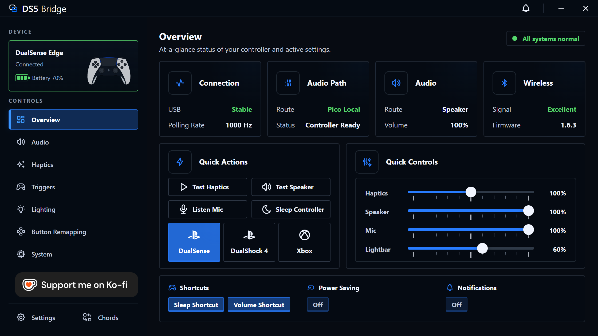
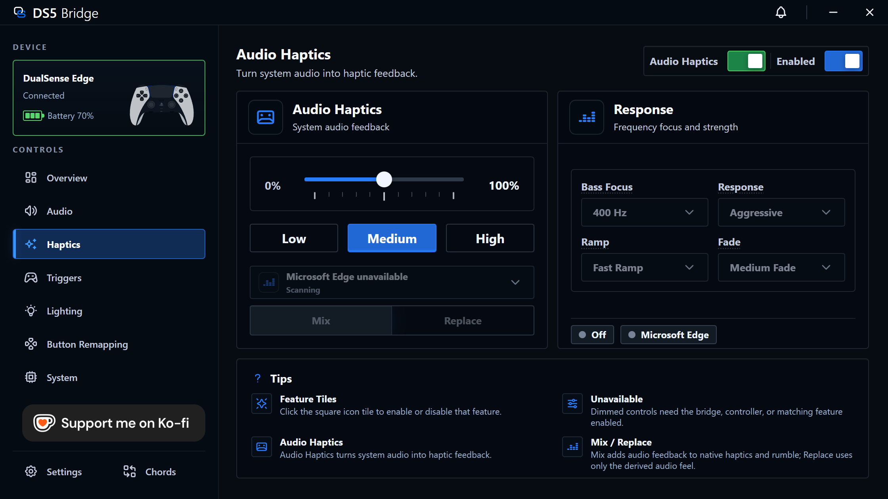
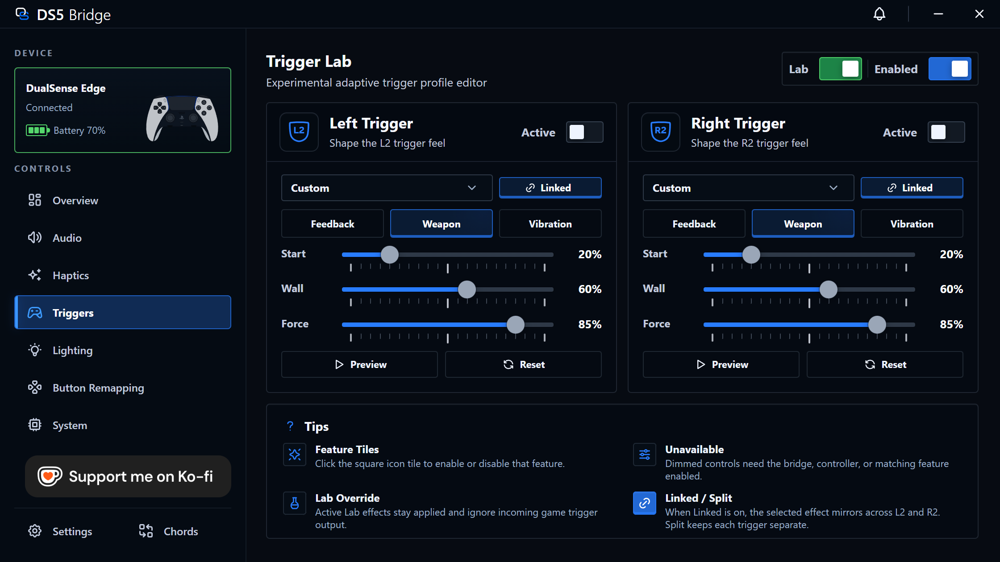
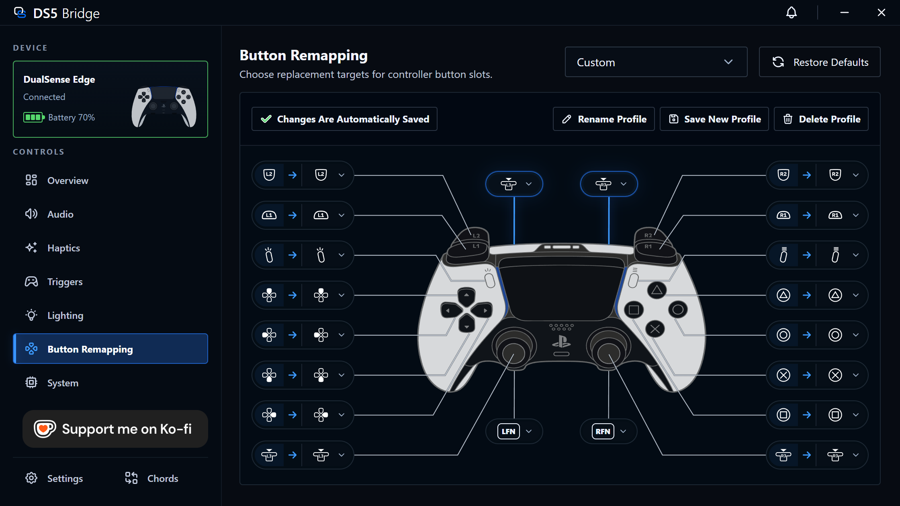
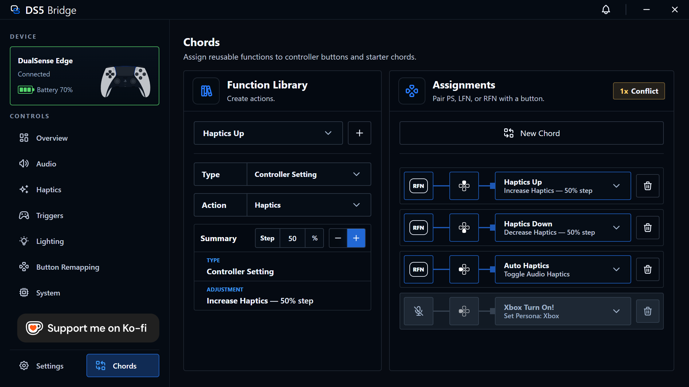
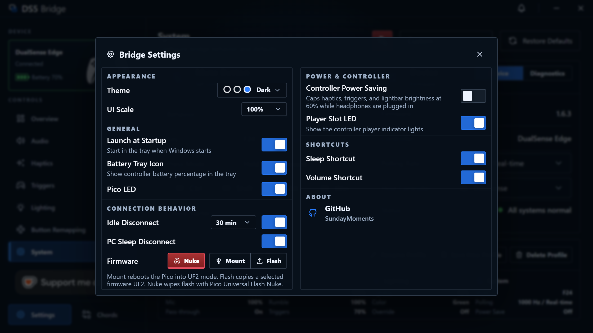

# DS5 Bridge

  

  
  
  
   
  

  

  <strong>DS5 Bridge 1.6.3 is live.</strong> 
  This release includes controller microphone support, Audio Haptics, Trigger
  Lab, controller personas, chords, and companion firmware tools.

DS5 Bridge lets you use a real Sony DualSense or DualSense Edge controller
wirelessly on a Windows PC through a Raspberry Pi Pico 2 W. The controller pairs
to the Pico over Bluetooth, and the Pico plugs into your PC over USB.

The companion app gives you a clean place to adjust audio, haptics, trigger
strength, lighting, button remaps, shortcuts, firmware tools, and other
controller behavior without rebuilding firmware.

## Quick Start

1. Download the firmware `.uf2` and Windows companion installer from
   [Releases](https://github.com/SundayMoments/DS5_Bridge/releases/latest).
2. With the Pico 2 W unplugged, hold `BOOTSEL`, then connect it to your PC.
3. Copy the `.uf2` file onto the Pico drive that appears in Windows.
4. Put the DualSense controller into Bluetooth pairing mode by holding `Create`
   and `PS` until the lightbar rapidly blinks blue.
5. Wait for the controller to pair to the Pico, not directly to Windows.
6. Install and open DS5 Bridge. The Overview page should show the connected
   bridge and firmware version.

Once the controller connects to the Pico, Windows sees it as a normal
DualSense-compatible USB controller.

## Features

- Use a DualSense or DualSense Edge wirelessly through a Pico 2 W.
- Use the controller speaker, headset jack, microphone, and audio-driven haptics.
- Tune audio, haptics, adaptive triggers, and lighting from the Windows app.
- Use Audio Haptics to turn system or app audio into controller feedback.
- Save controller setups as profiles.
- Remap buttons and assign chord shortcuts.
- Switch the host persona between DualSense, DualShock 4, and Xbox modes.
- See Bluetooth signal quality at a glance.
- Mount, flash, or nuke Pico firmware from Bridge Settings.

## Companion App Tour

The companion app is where you check the bridge, adjust the controller, and save
the setup you actually want to play with.

### Overview

See connection health, firmware version, battery, audio route, Bluetooth signal
quality, host persona, and the settings most likely to matter during play.

  

### Audio

Control the controller speaker, headphone-jack route, microphone level, speaker
gain, and buffer length.

  

### Haptics

Adjust HD haptics, classic rumble, feedback boost, and audio buffer length, then
test the feel before opening a game.

  

### Audio Haptics

Turn system audio or an app session into controller haptic feedback.

  

### Triggers

Set adaptive trigger strength, try effects, or open Trigger Lab for per-trigger
profiles.

  

### Trigger Lab

Build and preview adaptive trigger effects before applying them to the controller.

  

### Lighting

Choose lightbar brightness and color, or let the app manage lighting behavior
for you.

  

### Button Remapping

Change what each controller button does, then save the remap when you are happy
with it.

  

### System

Manage profiles, mute button behavior, polling rate, host persona, diagnostics,
and device repair.

  

### Chords

Create reusable keyboard, media, and controller actions, then assign them to
starter chords.

  

### Bridge Settings

Set theme, UI scale, tray and startup behavior, firmware maintenance, power
saving, LEDs, shortcuts, idle disconnect, and PC sleep disconnect.

  

## Troubleshooting

- Use the companion app and firmware from the same release when possible.
- For first-time flashing, hold `BOOTSEL` before plugging the Pico 2 W into the
  PC. The Pico should appear as a USB drive.
- Pair the controller to the Pico, not Windows. Hold `Create` and `PS` until the
  lightbar rapidly blinks blue.
- If audio, mic, haptics, or flashing behave oddly, try a direct USB port and a
  data-capable micro-USB cable before using a hub.
- If controller audio sounds doubled, distorted, or too loud, restart your PC,
  reopen DS5 Bridge, and run the speaker test again.
- If Windows keeps stale or duplicate controller/audio devices, use
  [Windows device cleanup](docs/windows-device-cleanup.md) or System >
  Emergency Device Repair.
- Battery level may be inaccurate while the controller is charging.

## Requirements

- Raspberry Pi Pico 2 W.
- Sony DualSense or DualSense Edge controller.
- Data-capable USB cable with a micro-USB end for the Pico 2 W.
- Windows for the companion app.

## For Developers

See [docs/development.md](docs/development.md) for local build requirements,
firmware build commands, companion app setup, audio helper notes, and packaging
steps.

## Project Layout

| Path | Purpose |
| --- | --- |
| `src/main.cpp` | Pico startup, watchdog handling, USB task loop, and HID report bridge. |
| `src/bt.cpp` | Bluetooth inquiry, pairing, L2CAP HID channels, and report queueing. |
| `src/audio.cpp` | USB audio ingestion, haptic resampling, Opus speaker encoding, and audio packet assembly. |
| `src/companion.cpp` | Vendor HID companion protocol, status reports, command ACKs, and runtime setting dispatch. |
| `src/usb.cpp` | TinyUSB audio control callbacks and runtime settings fallback. |
| `src/usb_descriptors.c` | USB device, configuration, HID report, audio, and string descriptors. |
| `companion/` | Electron companion app source, protocol parser, HID service, assets, and UI. |
| `companion/native/AudioHelper/` | Windows audio helper used by the companion app for audio sessions, haptics mirroring, endpoint setup, and media integrations. |
| `.github/workflows` | CI and release builds. |

## Development Notes

- The bridge presents itself to the host as a standard DualSense-compatible USB
  controller for compatibility.
- The companion app requires firmware built with the companion HID interface
  enabled.
- The project controls runtime behavior through the bridge and does not write
  controller-side profiles.
- Battery level is not reported accurately while the controller is charging.
- During development, Windows may keep stale controller or audio endpoint
  records after descriptor testing. Use
  [docs/windows-device-cleanup.md](docs/windows-device-cleanup.md) only if you
  run into device or endpoint issues while testing.

## License

This repository is distributed as AGPL-3.0-only. See [LICENSE](LICENSE).

This project is derived from [awalol/DS5Dongle](https://github.com/awalol/DS5Dongle),
which is credited in [NOTICE](NOTICE). Third-party submodules and package
dependencies retain their own license terms.

DualSense controller overlay artwork is adapted from
[AL2009man/Gamepad-Asset-Pack](https://github.com/AL2009man/Gamepad-Asset-Pack)
and credited in [NOTICE](NOTICE).

## References

- [awalol/DS5Dongle](https://github.com/awalol/DS5Dongle), the foundation for
  this project.
- [rafaelvaloto/Pico_W-Dualsense](https://github.com/rafaelvaloto/Pico_W-Dualsense)
  for project inspiration.
- [egormanga/SAxense](https://github.com/egormanga/SAxense) for Bluetooth
  haptics proof-of-concept work.
- [Sony DualSense controller documentation](https://controllers.fandom.com/wiki/Sony_DualSense)
  for report structure notes.
- [Paliverse/DualSenseX](https://github.com/Paliverse/DualSenseX) for speaker
  report packet references.
- Alex Smith of The Cynic Project for the speaker test sound, "Crystal Cave"
  (`song18`).
