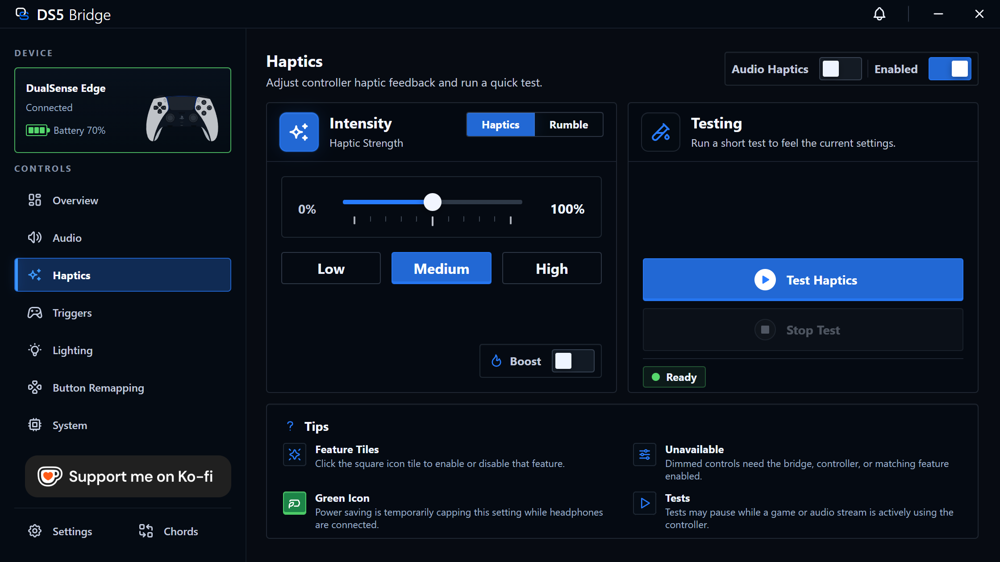
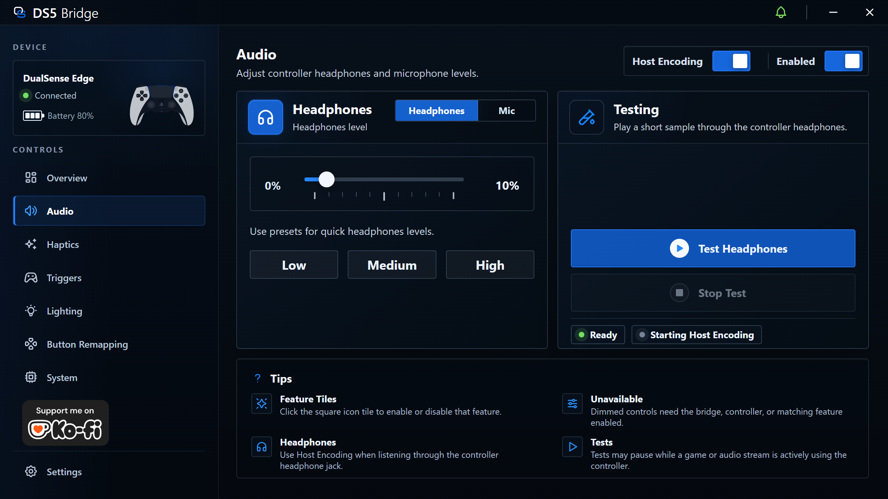
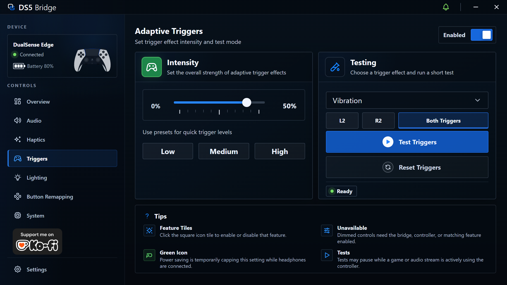
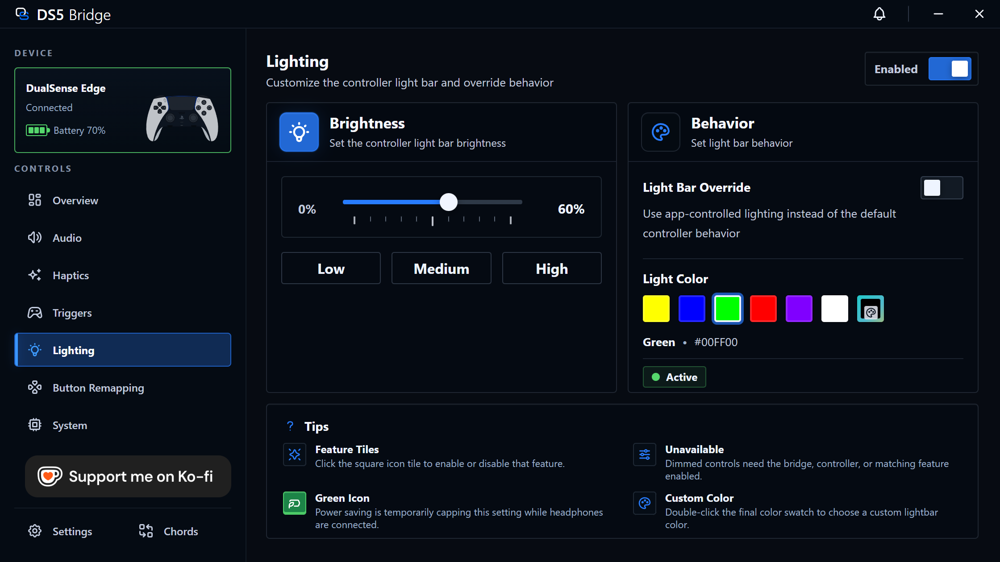
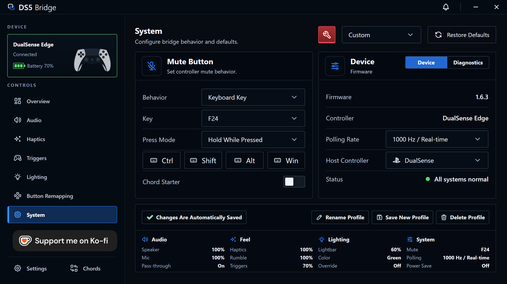

# DS5 Bridge

<p align="center">
  
</p>

DS5 Bridge lets you use a real Sony DualSense or DualSense Edge controller
wirelessly through a Raspberry Pi Pico 2 W. The controller pairs to the Pico over
Bluetooth, and your PC sees a standard DualSense-compatible USB controller. The
firmware is intended for PC use.

The public release includes the companion firmware and a Windows companion app
for tuning the controller without reflashing the Pico.

## Quick Start

1. Download the latest release package from this repository.
2. With the Pico 2 W unplugged, hold `BOOTSEL`, then connect it to your PC.
3. Copy the release `.uf2` firmware file to the mounted Pico storage device.
4. Put the DualSense controller into Bluetooth pairing mode.
5. Disconnect and reconnect the Pico 2 W, then wait for the controller to pair.
6. Open the companion app and choose a preset or customize the controller.

The controller appears on your PC after the bridge connects to the DualSense
over Bluetooth.

## What The App Can Do

- Adjust haptics strength.
- Set controller speaker volume and play a quick test tone.
- Preview, soften, or disable adaptive trigger effects.
- Choose lightbar color, brightness, and player LEDs.
- Use built-in presets: Balanced, Quiet, No Speaker, No Haptics, No Triggers,
  and Lights Off.
- Configure bridge behavior such as idle disconnect, PC sleep disconnect, Pico
  LED, and mute button actions.
- Show notifications when the controller connects, disconnects, or reaches a low
  battery level.
- Put the controller to sleep quickly with `PS Button + Triangle`.
- View connection status, battery level, firmware capabilities, and diagnostics.

## Companion App Tour

The app talks to the bridge through its own companion interface, leaving the
game-facing controller interface alone.

### Haptics

Set HD haptics strength or run a quick feedback test.

<p align="center">
  
</p>

### Audio

Control the DualSense speaker volume and run a short speaker test.

<p align="center">
  
</p>

### Triggers

Try adaptive trigger effects, adjust their strength, or turn them off.

<p align="center">
  
</p>

### Lighting

Choose a lightbar color, adjust brightness, control player LEDs, and decide
whether games or the companion app should control lighting. Double-click the
final gradient-bordered color option to open the custom color selector.

<p align="center">
  
</p>

### System

Check bridge status, battery level, diagnostics, mute button behavior,
notifications, idle disconnect, PC sleep disconnect, and Pico LED settings. You
can enable alerts for controller connect, disconnect, and low battery events, and
you can also enable the `PS Button + Triangle` shortcut to put the controller to
sleep. Quiet mode is available here when the mute button is set to Quiet Toggle;
it mutes controller haptics and speaker output together.

<p align="center">
  
</p>

## Troubleshooting

- If the speaker test tone plays through any speaker other than the controller,
  restart the companion app and try the speaker test again.
- The DualSense onboard microphone is not supported. Testing found that enabling
  controller speaker output and microphone input at the same time caused
  microphone stuttering, so microphone forwarding is disabled; the Pico 2 W does
  not have enough headroom for reliable full-duplex audio in this bridge.
- If the controller speaker sounds unnaturally loud, doubled, or distorted,
  reboot the PC, reopen DS5 Bridge, and run the speaker test again.
- Battery level is not reported accurately while the controller is charging.

## Requirements

- Raspberry Pi Pico 2 W.
- Sony DualSense controller.
- USB connection from the Pico 2 W to the PC.
- Windows for the companion app.

## For Developers

Initialize submodules first:

```powershell
git submodule update --init --recursive
```

Build the release firmware with the Pico SDK toolchain:

```powershell
cmake -S . -B build/companion -G Ninja `
  -DCMAKE_BUILD_TYPE=Release `
  -DPICO_SDK_PATH=/path/to/pico-sdk `
  -DENABLE_COMPANION=ON
cmake --build build/companion --target ds5-bridge
```

The resulting firmware is:

```text
build/companion/ds5-bridge.uf2
```

Build the companion app from `companion/`:

```powershell
cd companion
npm install
npm run typecheck
npm test
npm run build
```

For development:

```powershell
npm run dev
```

## Project Layout

| Path | Purpose |
| --- | --- |
| `src/main.cpp` | Pico startup, watchdog handling, USB task loop, and HID report bridge. |
| `src/bt.cpp` | Bluetooth inquiry, pairing, L2CAP HID channels, and report queueing. |
| `src/audio.cpp` | USB audio ingestion, haptic resampling, Opus speaker encoding, and audio packet assembly. |
| `src/companion.cpp` | Vendor HID companion protocol, status reports, command ACKs, and runtime setting dispatch. |
| `src/usb.cpp` | TinyUSB audio control callbacks and runtime settings fallback. |
| `src/usb_descriptors.c` | USB device, configuration, HID report, audio, and string descriptors. |
| `companion/` | Electron companion app source, protocol parser, HID service, assets, and UI. |
| `.github/workflows` | CI and release builds. |

## Development Notes

- The bridge presents itself to the host as a standard DualSense-compatible USB
  controller for compatibility.
- The companion app requires the release firmware because it uses the dedicated
  companion HID interface.
- The project controls runtime behavior through the bridge and does not write
  controller-side profiles.
- Battery level is not reported accurately while the controller is charging.
- During development, Windows may keep stale controller or audio endpoint
  records after descriptor testing. Use
  [docs/windows-device-cleanup.md](docs/windows-device-cleanup.md) only if you
  run into device or endpoint issues while testing.

## License

This repository is distributed as AGPL-3.0-only. See [LICENSE](LICENSE).

This project is derived from [awalol/DS5Dongle](https://github.com/awalol/DS5Dongle),
which is credited in [NOTICE](NOTICE). Third-party submodules and package
dependencies retain their own license terms.

## References

- [awalol/DS5Dongle](https://github.com/awalol/DS5Dongle), the foundation for
  this project.
- [rafaelvaloto/Pico_W-Dualsense](https://github.com/rafaelvaloto/Pico_W-Dualsense)
  for project inspiration.
- [egormanga/SAxense](https://github.com/egormanga/SAxense) for Bluetooth
  haptics proof-of-concept work.
- [Sony DualSense controller documentation](https://controllers.fandom.com/wiki/Sony_DualSense)
  for report structure notes.
- [Paliverse/DualSenseX](https://github.com/Paliverse/DualSenseX) for speaker
  report packet references.

## Disclaimer

This project was vibecoded, so the occasional peculiarity may show through.
That said, it has been tested and edited with care.
