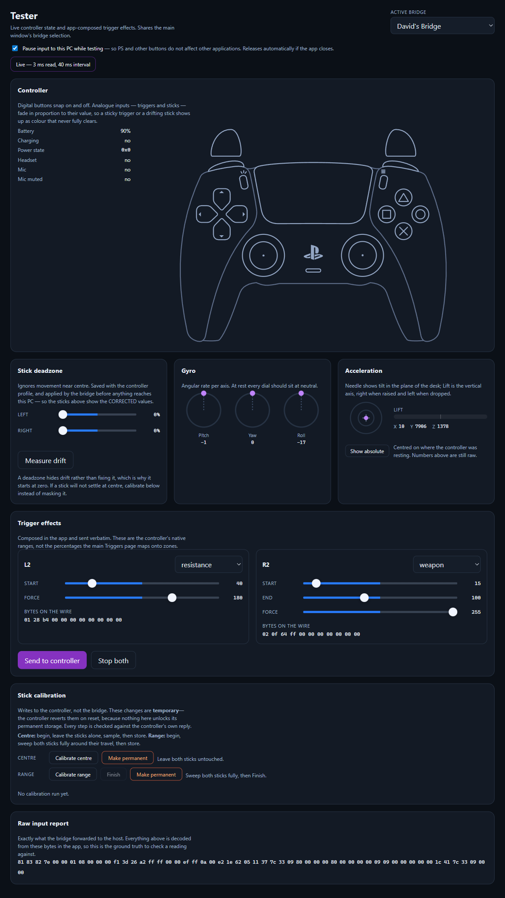
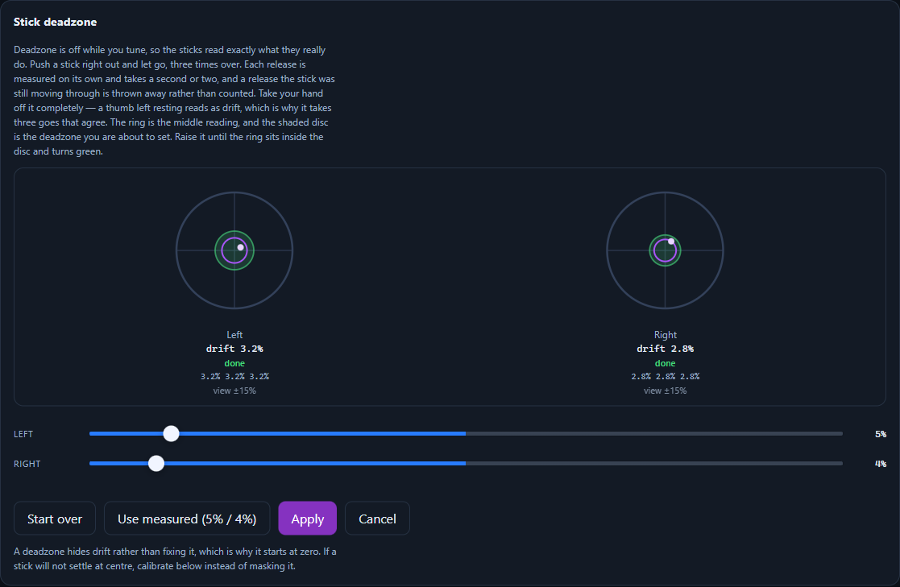
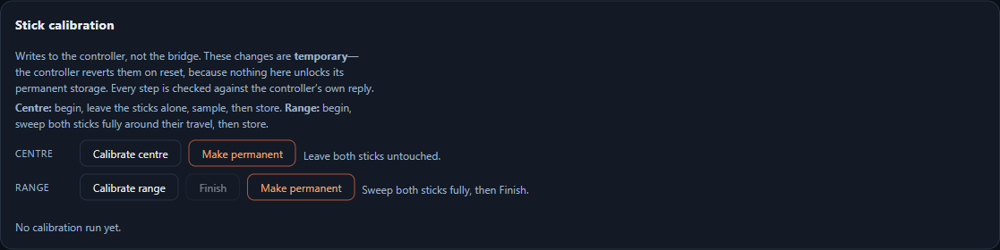
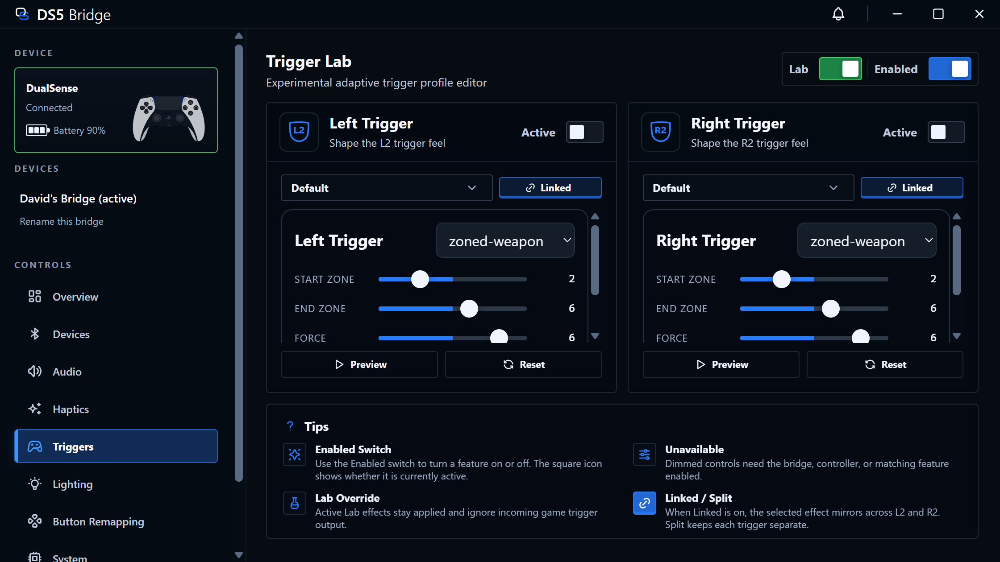

# DS5 Bridge — Linux port: technical change notes (for upstream / Windows backporting)

This document records every substantive fix and feature added in the **CachyOS/Linux port**
([djanice1980/DS5_Bridge](https://github.com/djanice1980/DS5_Bridge)), forked from
[SundayMoments/DS5_Bridge](https://github.com/SundayMoments/DS5_Bridge) at commit `99611b5`.

It's written so the upstream (Windows) author can decide what to backport **without reverse-engineering
the diffs** — each item lists the symptom, the root cause, the exact change (files/functions), and whether
it applies to Windows.

**Legend — applies to Windows:**
- ✅ **Yes** — shared code (firmware, or companion logic the Windows build also has). Backport directly.
- ⚠️ **Latent** — the bug exists in shared code but doesn't *manifest* on Windows today; worth a defensive fix.
- ❌ **Linux-only** — platform plumbing; documented for completeness, not for backport.
- 🚫 **Superseded** — we recommended it and later found it was the wrong fix. Left in place with the
  correction, because a retracted recommendation is more useful than a deleted one.

> **Read the retractions first (items 1 and 2).** They were the headline recommendations in the
> original version of this document and they are now **withdrawn**. We shipped that scheduler, ran
> it for weeks, and eventually deleted it — the symptom it was built for had a different cause. You
> appear to have reached the same conclusion independently (`be45d68 revert(app): remove audio
> interleave experiment`), so this is confirmation rather than news, but the original text would
> otherwise send you down a road we have already walked back.

---

## Backport priority (TL;DR)

Items 10+ were added 2026-08-07 and are the substance of this revision.

| # | Change | Layer | Windows |
|---|--------|-------|---------|
| 1 | ~~Two firmware guards suppress controller state during audio~~ — real cause was the audio state snapshot; see the retraction | Firmware | 🚫 **Superseded by 12** |
| 2 | ~~Fair-interleave output scheduler + runtime tuning~~ — **we deleted this**; see the retraction | Firmware | 🚫 **Superseded** |
| 3 | **Switching a controller between two dongles needs a flash-nuke** — stale BT link key | Firmware | ✅ High |
| 4 | **Firmware version lives in two un-synced constants** — flashed build misreports its version | Firmware | ✅ Medium |
| 5 | **`BUNDLED_FIRMWARE_VERSION` silently drifts** from the firmware version | Companion | ✅ Medium |
| 6 | **Blank profile dropdown** — a fixed-column CSS grid assumed a conditionally-rendered icon | Companion | ⚠️ Latent |
| 7 | **App version not surfaced anywhere in the UI** (`app:getVersion` IPC + About line) | Companion | ✅ Low |
| 8 | **`DS5_DEBUG=1` opt-in debug mode** (DevTools + load logging) | Companion | ✅ Low |
| 18 | **Protocol convergence: fork moved to 0x60–0x6F, adopted your 0x36/0x37** — proposal to reserve the range | Both | ✅ High (discussion) |
| 19 | **HID feature-report cache serves a stale controller until manual refresh** | Companion | ⚠️ High (discussion) |
| 9 | Linux audio-haptics, libusb transport, uinput, WirePlumber, packaging, KDE icon | Linux plumbing | ❌ |
| 10 | **Never bump `PROTOCOL_MINOR` for an additive command id** — it is compared exactly, so every older firmware reads as "bridge not detected" | Both | ✅ **High** |
| 11 | **A disconnect that never completes wedges the connection phase** until power-cycle | Firmware | ✅ **High** |
| 12 | **Adaptive triggers die under audio** — the real cause: the audio state snapshot replays stale trigger state over the effect just sent | Firmware | ✅ **High** |
| 13 | **Trigger presets must use the simple effect family** — the zone-packed family is silently rejected by some controllers | Firmware | ✅ High |
| 14 | **Three separate writers fight over the lightbar** — a hardcoded connect colour destroys the user's saved one | Firmware | ✅ High |
| 15 | **Deleting a link key does not forget a controller** — it re-pairs itself; needs a durable blacklist | Firmware | ✅ High |
| 16 | **Controller tester** — live input, drift measurement, stick calibration (feature) | Both | ✅ Feature |
| 17 | **Trigger Lab on native ranges** — percentages could not express what the hardware accepts | Both | ✅ Feature |

---

## Firmware (shared `.uf2` source — highest backport value)

### 1. Adaptive triggers & rumble weaken/click while audio streams to the controller ✅

**Symptom.** With audio routed to the DualSense (system audio-haptics, or speaker), adaptive triggers only
"click" instead of fully engaging, and classic rumble weakens. They recover a few seconds *after* audio stops.
Reproduced on Windows too — this is **not** Linux-specific.

**Wrong theory (do not chase).** "Loud audio saturates the controller↔dongle Bluetooth link, so trigger data
can't get through." Disproven: a game that re-asserts the trigger effect **every frame** holds the trigger
firm *through* audio (verified with `tools/trigger-hold.py`). A one-shot command decaying to a click is the
controller latching a single command, not bandwidth starvation.

**Root cause.** `src/bt.cpp` had **two guards, both upstream of the output scheduler**, that discarded
controller-state output whenever audio was being routed to the controller
(`audio_output_route_protected() == audio_recent() || usb_speaker_streaming_active()`):

1. **Guard A** — in `bt_write_classified_output`, an audio-protected **DROP** block threw controller-state
   packets away *before they were ever queued*. (commit `dd2512d`)
2. **Guard A2** — at the scheduler's `CoalescedState` branch, `if (state_send_blocked_by_audio_locked(now)) return false;`
   vetoed a state packet *even after the scheduler had chosen to send it*. During continuous audio this is
   always active. (commit `3b15775`)

Because both sat in front of the scheduler, the fair-interleave logic never got to arbitrate — audio won
every Bluetooth slot and controller state (triggers/rumble/lightbar via the coalesced path) only escaped in
audio-buffer gaps, arriving late/rarely.

**Fix.** Remove both guards so the **output scheduler is the single arbiter** (see #2). Adaptive-trigger
*test* commands still travel the urgent path and click under audio by design; real games re-assert per frame
and now hold firm.

**Windows applicability.** ✅ Direct — the guards and the scheduler are in the shared firmware. Windows shows
the identical symptom. Backport = delete both guards **and** land the scheduler in #2 (without the scheduler,
removing the guards would let audio starve state; with it, both share the link fairly).

> ### 🚫 RETRACTION (2026-08-07) — the guards were real, the prescription was not
>
> Removing the two guards **was** correct and still stands. The rest of the advice above was not.
>
> Deleting the guards did not fix the symptom, because the guards were not the whole cause.
> Triggers still died under audio, and we spent weeks tuning the scheduler in #2 trying to buy
> them a slot — treating it as an arbitration problem when nothing was being starved.
>
> **The actual cause is item 12 below:** the audio path snapshots controller state and replays it
> into every composed packet, so a trigger effect sent while audio flows is immediately overwritten
> by the snapshot taken *before* it. The link was never the constraint. The proof was always in
> front of us — daidr's browser tester holds a trigger firm through the same audio on the same
> controller, and it has no scheduler at all.
>
> **Do not implement the scheduler.** Fix the snapshot instead.

---

### 2. Fair-interleave output scheduler + runtime tuning 🚫 SUPERSEDED — DO NOT BACKPORT

> ### 🚫 RETRACTED (2026-08-07) — we shipped this, then deleted it
>
> This was the centrepiece of the original document and it was wrong. We removed it entirely in
> firmware 1.6.59: the scheduler, the `0x34` runtime-tuning command, the persisted settings, and
> the Interleave page in the app. Command id `0x34` is now reserved and refused so an old companion
> cannot re-enable a code path that no longer exists.
>
> **Why it had to go, beyond being unnecessary.** It was not neutral. It was a second scheduler in
> front of the one the stack already had, it added a runtime-tunable knob to a timing-sensitive
> path, and it gave every "triggers feel wrong" report a plausible-looking dial to blame — which is
> exactly why the real cause stayed hidden for as long as it did. The presets shipped to users, so
> people tuned a setting that could not fix their problem.
>
> You reverted your own copy in `be45d68` on 2026-07-30. This is written up anyway, because the
> *reason* matters more than the revert: a fix that makes a symptom slightly better is worse than
> no fix, because it ends the investigation.
>
> The description below is preserved for reference only.

**What.** A scheduler that balances the audio stream against coalesced controller-state on the single
Bluetooth output path, replacing "audio always wins."

**Files.**
- `src/output_scheduler.h` / `src/output_scheduler.cpp` — `output_scheduler_choose_interrupt_packet(...)`.
- `src/bt.cpp` — per-connection counters + runtime setter.

**Logic** (`output_scheduler.cpp`):
```
state_starved = coalesced_state_available &&
                (consecutive_audio_sends >= max_consecutive_audio_sends ||
                 state_age_us            >= state_max_age_us);
if (state_starved)            return CoalescedState;   // guarantee a slot
if (audio_available)          return AudioStream;      // else keep the audio buffer full
if (coalesced_state_available) return CoalescedState;
return None;
```
So audio wins by default (buffer stays full), but a pending state packet is **guaranteed** a slot after
`max_consecutive_audio_sends` audio packets in a row **or** once it has waited `state_max_age_us`. Steady
gameplay with nothing changing still leaves audio ~100%. New scheduler inputs: `consecutive_audio_sends`
(incremented on each audio send, reset on any non-audio send, tracked in `bt.cpp`) and `state_age_us`.
Defaults: **4 packets / 3000 µs**.

**Runtime tuning (no reflash).** `CommandSetAudioInterleave = 0x34` (`src/companion.cpp`) carries
`value = max_consecutive_audio_sends` and `read_u16(buffer+10) = state_max_age_us`, dispatched to
`bt_set_audio_interleave()` / `bt_reset_audio_interleave()` (`src/bt.cpp`). `CommandRestoreDefaults` calls the
reset. Companion side: shared `AUDIO_INTERLEAVE_*` constants + `SET_AUDIO_INTERLEAVE` in
`companion/src/shared/protocol.ts`, two persisted global settings in `settings-store.ts`, `setAudioInterleave()`
in `bridge-service.ts` (best-effort resend on connect), and an **Interleave** page in the renderer with a
Smooth/Balanced/Responsive preset knob + advanced raw values.

**Note on protocol versioning:** the new command is dispatched by command-id; `PROTOCOL_MINOR` was **not**
bumped, because `protocol.ts assertVersion` is a strict exact `major.minor` match on the status parse — bumping
it breaks old-firmware/new-app pairs. Old firmware NACKs an unknown command harmlessly, so command-id dispatch
is forward/backward compatible. Don't gate new commands on a protocol/firmware-flag version.

**Windows applicability.** ✅ Direct.

---

### 3. Switching a controller between two dongles requires a flash-nuke ✅

**Symptom.** A DualSense paired to dongle A, then paired to dongle B (another PC), will not reconnect to
dongle A. Re-flashing A's firmware doesn't help — only a full flash **nuke** does.

**Root cause** (`src/bt.cpp`). The dongle stores the controller's BT link key in flash (BTstack TLV), which
survives a `.uf2` reflash. Two connection paths exist:
- **Inbound reconnect** — a controller still bonded to *this* dongle pages it → `HCI_EVENT_CONNECTION_REQUEST`.
  Stored key is valid; keep it.
- **Outbound pairing** — the dongle's **inquiry** finds a controller and pages it → `new_pair = true` at
  `HCI_EVENT_INQUIRY_COMPLETE`. A controller is only *discoverable by inquiry when it's in pairing mode*, i.e.
  it wants a **fresh** bond — so any key we still hold for it is stale.

On the outbound path, `HCI_EVENT_LINK_KEY_REQUEST` replied with the **stale** stored key; the controller
(re-bonded elsewhere) rejected it → auth failed. There *is* a drop-key-on-auth-failure
(`gap_drop_link_key_for_bd_addr(current_device_addr)` in `HCI_EVENT_AUTHENTICATION_COMPLETE`), but it doesn't
rescue you: the disconnect that follows a failed auth hits `HCI_EVENT_DISCONNECTION_COMPLETE`, which
**`watchdog_reboot`s the dongle** — almost certainly before the key-drop persists to flash (or the controller
tears down the link before the auth-complete event fires). The stale key survives → the next attempt offers it
again → loop → only a nuke clears it.

**Fix.** Drop the stored key on the outbound path **before** connecting:
```cpp
// at HCI_EVENT_INQUIRY_COMPLETE, where new_pair = true, before hci_create_connection:
gap_drop_link_key_for_bd_addr(current_device_addr);
```
`LINK_KEY_REQUEST` then negative-replies → clean fresh SSP → new key stored → connects. It also clears the key
already in flash on the next pairing, so no nuke is needed to adopt the fix. Inbound reconnection is untouched.

**Windows applicability.** ✅ Direct (shared BT stack). Anyone who moves one controller between two dongles.

---

### 4. Firmware version lives in two un-synced constants ✅

**Symptom.** After bumping the version, the flashed firmware reported the *old* version on the companion's
System page.

**Root cause.** The version is duplicated: the **status report** sends
`kFirmwareMajor/Minor/Patch` from `src/companion.cpp` (bytes 24–26), which is **separate** from
`pico_set_program_version(...)` in `CMakeLists.txt`. Bumping only the CMake one left the reported version stale.

**Fix / rule.** Bump **both** on every firmware version change. (In this port a *third* location — the
companion's `BUNDLED_FIRMWARE_VERSION`, see #5 — must also match; a release-validation test enforces
`bundled == companion.cpp firmware`.)

**Windows applicability.** ✅ Same two constants exist upstream.

---

## Companion — shared logic (backportable)

### 5. `BUNDLED_FIRMWARE_VERSION` silently drifts ✅

**Symptom.** The in-app "firmware update available" check misbehaved; the release-validation script failed.

**Root cause.** `companion/src/main/bridge-service.ts` has `const BUNDLED_FIRMWARE_VERSION = 'x.y.z'` that drives
`firmwareUpdateAvailable` and is asserted equal to the `companion.cpp` firmware version by
`tools/create-release-candidate.ps1`. It had drifted (stuck at an old value through several firmware bumps).

**Fix / rule.** Treat it as the **third** place the firmware version lives (with `companion.cpp` and
`CMakeLists.txt`); bump all three together. Its two unit tests in `bridge-service.test.ts` encode the value and
must move with it.

**Windows applicability.** ✅ Same constant + test upstream.

### 6. Blank controller-profile dropdown ⚠️ (latent on Windows)

**Symptom (Linux).** The System-page profile selector rendered as an empty box with an empty menu, even though
the profile data (`Default`) was correct end-to-end.

**Root cause.** `.system-page .profile-controls` (`companion/src/renderer/styles.css`) used a **fixed
3-column grid** `grid-template-columns: 38px minmax(0,1fr) auto` where the 38px column is for the **Emergency
Repair** icon — which is rendered **only when `IS_WINDOWS_HOST`** (`App.tsx`). With the icon absent, the two
remaining children shifted left: the profile `<CustomSelect>` landed in the 38px column and its label was
clipped to just the chevron; the dropdown menu inherited the ~38px width and looked empty. (Everything else —
`getStatus()`, the React state, the options — was correct; confirmed via DevTools that the button's `<span>`
literally contained "Default", just 38px wide.)

**Fix.** Scope the 38px column to a `.profile-controls--repair` class applied only when the repair icon
renders; otherwise 2 columns.

**Windows applicability.** ⚠️ On Windows the icon **is** present, so the grid balances and it doesn't manifest —
but it's a latent fragility: any future change that conditionally hides that icon re-introduces it. A defensive
"columns follow children" grid is worth adopting.

### 7. App version surfaced in the UI ✅

**What.** There was **no** place in the UI showing the companion's own version — every "which build am I on?"
question was guesswork. Added an `app:getVersion` IPC (`ipcMain.handle('app:getVersion', () => app.getVersion())`
in `main.ts` → `getAppVersion` in `preload.ts` → an `appVersion` state fetched in `App.tsx`) and a
`DS5 Bridge · Version x.y.z` line in **Settings → About**.

**Windows applicability.** ✅ Same gap upstream.

### 8. `DS5_DEBUG=1` opt-in debug mode ✅

**What.** Launching from a terminal with `DS5_DEBUG=1` set (env-gated, invisible otherwise): opens detached
DevTools (`main.ts`) and logs the settings the store loaded from disk to stdout (`settings-store.ts`). Documented
in the README "Debug mode" section. It's what finally cracked #6 (read the live DOM instead of theorizing).

**Windows applicability.** ✅ Generic; a permanent field-diagnostics switch.

---

## Linux-port plumbing (❌ not for backport — reference only)

These are how the Windows features were re-implemented on Linux; they don't apply to a Windows build.

- **Audio haptics via the exposed 4.0 sink.** Windows writes the 4-channel UAC device's ch2/3 (grip actuators)
  via WASAPI. Linux mirrors the default sink's FL,FR → the ported DSP → `pw-play --raw --channels 4
  --channel-map FL,FR,RL,RR` into the bridge sink (RL,RR = USB ch2/3). **Critical fix:** `pw-record`/`pw-play`
  need **`--raw`** (headerless PCM; without it libsndfile rejects the stream and the helper dies). The
  vendor-USB-frames path (interface 5 = lightbar/triggers/rumble control) was the *wrong* transport for haptics
  and flooding it choked triggers — removed.
- **libusb companion transport.** The Windows WinUSB companion bridge is re-implemented as an `AudioHelper
  --companion-transport` NDJSON pipe (control transfers + bulk OUT), used by the app and by `tools/trigger-probe.py`.
- **`uinput`** for keyboard/chord key injection (Windows uses SendInput).
- **WirePlumber UCM fix** (`packaging/linux/52-ds5-bridge-noucm.conf`): the ALSA UCM profile hides the 4-channel
  device; a shipped WirePlumber rule restores it (else the speaker is quiet and grips don't buzz).
- **KDE Wayland taskbar/window icon.** KDE maps a window to its icon by the app-id it reports → a `.desktop`
  file. Electron derived that id from the product name **"DS5 Bridge"** (space + capitals), which doesn't match
  the installed `ds5-bridge.desktop`, so the icon fell back to a placeholder. Fixed with `app.setName('ds5-bridge')`
  on Linux (with `app.setPath('userData', <appData>/'DS5 Bridge')` pinned first so settings are preserved, since
  `setName` also drives the userData dir). Windows uses AppUserModelID, so N/A.
- **Packaging.** AppImage + pacman via electron-builder; udev rules (`60-ds5bridge.rules`) + a
  `pacman-after-install.sh` that SUIDs `chrome-sandbox`, refreshes desktop/icon caches, and loads `uinput`.
- **In-app firmware flash / Nuke on Linux.** The nuke image is built and hash-matched in the same CI step as the
  app (`release.yml`), so the bundled UF2 and the embedded SHA-256 always match; a standalone
  `DS5-Bridge-Flash-Nuke.uf2` (RP2350) is also committed for manual BOOTSEL wipes.

---

## Diagnostic tools added (`tools/`)

- **`trigger-hold.py`** — writes the firmware's exact `set_trigger_feedback` effect to the DualSense gamepad
  hidraw every ~10 ms, to test whether *continuous* maintenance holds a trigger under audio (it does). This is
  the experiment that disproved the BT-saturation theory in #1.
- **`trigger-probe.py`** — drives the companion transport (NDJSON): `engage`/`rumble`/`latency`/`trace` modes;
  trace mode reads the firmware trigger-trace ring and separates audio packets from controller-state packets.
  Needs the `-DDS5_DIAGNOSTICS_PRESET=traces` firmware build.

---

*Generated for the Linux port at companion 1.6.18 / firmware 1.6.13. Commit range: `99611b5..HEAD`.*

---

# Addendum — findings from the 2026-08-03/04 crash investigation

Added at companion 1.6.43 / firmware 1.6.38. Everything below was found while chasing a
reconnect crash in the Linux fork; this section lists only what we believe affects
**SundayMoments/DS5_Bridge** as it stands today, plus one item that does *not* but is worth
knowing about.

## 1. Devices tab: Pair / Forget are unusable in the state they exist for — ✅ Yes

**Symptom.** With no controller connected, **Pair Controller** and **Forget Controllers**
are greyed out and cannot be pressed.

**Root cause.** A controller disconnect soft-detaches the whole USB device
(`tud_disconnect()` in the `usb_pm_poll()` reconciliation). That removes *every* interface,
including the companion/vendor HID the app talks over — so the app has no bridge to reach,
the snapshot state is not `connected`, and both buttons disable. `tud_connect()` is only
called from the controller-driven attach path, and there is no idle/companion-only
descriptor set.

**Why it matters.** It inverts both buttons. Pairing is most needed when nothing is
attached; forgetting a stale pairing is most needed when a controller *won't* connect. In
our fork the empty-state text under them ("...then press Pair Controller") describes a flow
that cannot happen. BOOTSEL still covers pairing, so the genuinely unreachable function is
**Forget Controllers**, whose only fallback is a flash nuke — the very thing the button was
added to replace.

**Fix direction (not yet implemented on our side either).** Present a **companion-only
configuration while idle**: the vendor interface without the gamepad/audio interfaces, so
the app can always reach the bridge but the host never sees a phantom controller. Note the
MS OS 2.0 descriptor keys WinUSB binding to the interface *number*
(`VENDOR_BRIDGE_INTERFACE_NUMBER` in the function subset header), so a reduced configuration
needs its MS OS 2.0 descriptor rebuilt to match — the xusb360 persona already does exactly
this at runtime (`build_xusb_configuration_descriptor` / `build_xusb_ms_os_20_descriptor`),
so the pattern exists to copy.

## 2. TinyUSB endpoint desync panic — ⚠️ Latent, shared

**Symptom.** Rare, non-reproducible "the bridge rebooted" during controller reconnect.

**Root cause.** TinyUSB's `panic("ep %02X was already available")` in
`_hw_endpoint_buffer_control_update32`, reached from `tud_hid_report()` when software
endpoint state says free while hardware still has `USB_BUF_CTRL_AVAIL` set. The enabling gap
is upstream TinyUSB's: `rp2040_usb.h`'s `hw_endpoint_lock_update()` is an **empty inline**
whose comment reads *"todo add critsec as necessary to prevent issues between worker and
IRQ"*. Calling `tud_hid_report()` from the main loop alongside the USB ISR is precisely that
worker-vs-IRQ case, and both codebases do it.

**Why it is easy to miss.** `panic()` is `noreturn` and spins with interrupts off, so the
watchdog reset is its only exit — from outside it is indistinguishable from a main-loop
stall. We chased it as a "hang" for several builds.

We saw it once, on our last firmware that still deinitialised the stack, and not since
adopting soft detach. That is *consistent with* the teardown being the trigger, but one
non-recurrence is not proof, and the underlying race is untouched either way.

## 3. `tud_deinit()` stale state → NULL-mutex hard fault — ❌ Not applicable to you

Recorded only so nobody reintroduces the pattern.

TinyUSB **0.20.0**'s `tud_deinit()` sets `_usbd_mutex = NULL` but does not clear
`_usbd_dev`. Since `tud_mounted()` is `return _usbd_dev.cfg_num ? true : false`, and the HID
class driver has no `deinit` to clear `_hidd_itf`, **`tud_hid_ready()` keeps returning true
after deinit** — so the documented check-then-send contract dereferences a NULL mutex and
hard faults.

**You are not exposed:** commit `628436a` ("Defer controller USB transport transitions")
removed `tusb_deinit` in favour of the attached-flag soft detach, so the window does not
exist in your tree. Our fork kept the deinit from the shared ancestor and hit this. If a
deinit is ever reintroduced (for persona switching or suspend), gate every device-stack call
on `tud_inited()` as well as the class ready predicate — the class predicate alone is not
sufficient on 0.20.0. TinyUSB fixed it in **0.21.0** (`tu_varclr(&_usbd_dev)` in
`tud_deinit()`); we pin 0.20.0 explicitly, so it is worth checking what your build resolves
to.

## 4. Technique worth stealing: make a crash stop looking like a hang

The single biggest time sink above was that **two separate layers disguise a crash as a
stall**:

- A watchdog reset looks like a hang regardless of what caused it.
- The Pico SDK's default `isr_hardfault` is a **breakpoint**, which with no debugger attached
  simply locks the core until the watchdog fires.

Three cheap changes turned a mystery reboot into a named function and address, and they cost
nothing until something goes wrong:

1. **Override the fault vectors** (`isr_hardfault`/`isr_memmanage`/`isr_busfault`/
   `isr_usagefault`, all weak in `crt0.S`). Naked handlers, capture the exception frame
   (`frame[6]` is the faulting PC), read `CFSR`/`HFSR`/`BFAR`, stash it somewhere that
   survives a reset.
2. **`-Wl,--wrap=panic`** so a `panic()` records its caller instead of silently spinning.
   Verification trick: if the wrap took, the SDK's real panic body is no longer referenced
   and its `"*** PANIC ***"` string disappears from the linked image.
3. **Publish the `.elf.map` as a CI artifact** so a reported PC can be resolved to a symbol.
   Resolve against the map from the *same* build — layout shifts between builds, and
   comparing a PC against a different build's map cost us one wrong conclusion.

Watchdog scratch registers survive the reset and are a convenient place to put the record.
Full inventory of what we built, with removal steps, is in
[`docs/diagnostic-scaffolding.md`](diagnostic-scaffolding.md).

---

# Addendum — 2026-08-05/07

Added at companion 1.6.104 / firmware 1.6.68. Fixes first, then the features, then the two
process traps that cost us the most time.

Everything here is in `djanice1980/DS5_Bridge` on `main`. The commit named under each item is
self-contained and carries the reasoning in its message.

## Taking the code

Each item below is one or a few commits that apply cleanly on their own. To cherry-pick rather
than re-implement:

```bash
git remote add djanice https://github.com/djanice1980/DS5_Bridge.git
git fetch djanice
git cherry-pick <sha>
```

| Item | Commit(s) | What it touches |
|---|---|---|
| 10 — protocol minor | `a01d210` | `src/companion.cpp`, `companion/src/shared/protocol.ts`, guard |
| 11 — disconnect watchdog | `a1eae55` | `src/bt.cpp`, guard |
| 12 — trigger state snapshot (the real audio fix) | `3333583`, then `d1211d3` to delete the scheduler | `src/bt.cpp`, `src/companion.cpp` |
| 13 — simple trigger family for presets | `1268063` | `src/companion.cpp`, guard |
| 14 — lightbar writers | `46d5d3c`, `693b624`, `787fdd1` | `src/bt.cpp`, `src/companion.cpp` |
| 15 — durable forget/blacklist | `c9dbdf1` + follow-ups | `src/bt.cpp` |
| 16 — tester, calibration | `cfc95b6`, `158eb3f`, `afa7473` | firmware + companion + renderer |

**Order matters for item 12.** Take `3333583` (publish into the snapshot) *before* `d1211d3`
(delete the scheduler) — the snapshot fix is what makes the scheduler unnecessary, and deleting
the scheduler first would make triggers worse in between.

The firmware guards live in `tests/firmware/` and run via `npm run test:firmware` from
`companion/`. They are source-text assertions, so they travel with the commits and will fail
loudly if a backport lands only half of a change.

**Licence.** Same as the upstream project — this is your code with our changes on top. Take
anything here with no attribution needed. The only third-party addition is the DualSense artwork
in the tester, from `daidr/dualsense-tester` (MIT), attributed in `NOTICE`.

---

## 10. Never bump `PROTOCOL_MINOR` for an additive command id — ✅ High

**Symptom.** After adding one new command, every bridge running older firmware reported
**"bridge not detected"** in the app, with a controller plainly connected and working.

**Root cause.** The companion compares the protocol minor **exactly**, not as a floor. Bumping it
to advertise a new capability tells every firmware that does not have the new number that it is
speaking a different protocol. The command id was additive and needed no version change at all.

**Why this is worth your attention.** The failure does not look like a version problem. It looks
like a USB or driver problem, and that is where the investigation goes first. We had the fix in
hand only because `git log -S` proved the minor had never moved before.

**Change.** Reverted the bump; gate new capabilities on `status.firmwareFlags` instead, which is a
bitfield and degrades correctly. A guard now reads the constant from **both** the firmware and the
companion and fails if they disagree, so the two cannot drift.

*Commit: `Do not bump the companion protocol minor for additive ids (fw 1.6.62)`*

---

## 11. A disconnect that never completes wedges the connection phase — ✅ High

**Symptom.** Rare, and we have never caught it in the wild — this was found by reading, not by a
bug report. If `hci_disconnect` goes out and `HCI_EVENT_DISCONNECTION_COMPLETE` never comes back,
the connection phase sits at `Disconnecting` with a live handle and no watchdog, until the bridge
is power-cycled.

**Root cause.** Every other recovery path in the loop escalates by calling `bt_disconnect()`. That
made `Disconnecting` the one phase with nothing left to escalate *to*.

**Change.** Two rungs in `bt_connection_recovery_loop()`, both clocked off the phase timestamp:
re-send at 2 s, give up and tear down locally at 30 s.

**Why 30 s, and why this is the interesting part.** A controller switched off or carried out of
range produces `DISCONNECTION_COMPLETE` from the chip itself only once **link supervision** lapses,
around 20 s. Any shorter deadline fires during an entirely ordinary disconnect and tears down state
while a real completion is still in flight — manufacturing the stale handle the rung exists to
prevent. The guard asserts the floor, not merely that the constant exists.

The teardown moved into one function shared by the event path and the give-up, so the two cannot
drift apart. A breadcrumb (`13/1` retry, `13/2` gave up) reports it, because a hole this
theoretical needs to announce itself if it ever turns out to be real.

*Commit: `Bound a disconnect that never completes (fw 1.6.67)`*

---

## 12. Adaptive triggers die under audio — the actual cause — ✅ High

**This supersedes items 1 and 2.** Read those retractions first.

**Symptom.** With audio routed to the controller, an adaptive trigger effect decays to a click.
A game that re-asserts the effect every frame holds firm; a one-shot command does not.

**Root cause.** The audio path keeps a **snapshot** of controller state and memcpys it into every
composed audio packet. An effect sent while audio flows is therefore overwritten, within
milliseconds, by a snapshot taken *before* it existed. The trigger command arrives perfectly
intact and is then undone by the next audio packet.

**Why we chased the wrong thing for weeks.** The symptom looks exactly like bandwidth starvation —
it only happens under audio, and it gets better if you send more often. Both are also true of a
write-ordering bug. The disproof was available the whole time: daidr's browser tester holds a
trigger firm through the same audio on the same controller with no scheduler at all. If a
third-party web page can do it over the same link, the link is not the constraint.

**Change.** Every trigger sender now **publishes into the audio state snapshot** as well as
sending. Write *through* the mirror, never around it. A guard asserts that every sender does this,
because one that forgets reintroduces the bug for one effect family only — which is exactly how
you get a bug report saying "weapon works but resistance doesn't".

*Commits: `Publish test trigger effects into controller state (fw 1.6.58)`,
`Remove the audio/controller interleave scheduler (fw 1.6.59)`*

---

## 13. Trigger presets must use the simple effect family — ✅ High

**Symptom.** Some preset trigger effects do nothing on some controllers. No error, no partial
effect: the controller simply ignores the command.

**Root cause.** The DualSense accepts two encodings — a simple family (`0x01` resistance, `0x02`
weapon, `0x06` vibration) and a zone-packed family (`0x21`/`0x25`/`0x26`). The zone-packed family
is **silently rejected** by some controllers. Presets were composed with the zone-packed family
because it is more expressive.

**Why it matters more than it looks.** A silently-rejected command is indistinguishable from a
firmware bug at the user's end, and it is hardware-dependent, so it reproduces on one desk and not
another.

**Change.** Presets emit the simple family. The expressive family remains available for
user-composed effects in Trigger Lab, where the user can see the bytes and tell whether the
controller took them. `OFF` is `0x05`.

*Commit: `Drive the trigger presets with the simple effect family (fw 1.6.56)`*

---

## 14. Three separate writers fight over the lightbar — ✅ High

**Symptom.** A user's saved lightbar colour reverts to blue after every controller power cycle.

**Root cause.** Three independent writers, and nobody owned the arbitration:

1. the **bridge** applying a hardcoded blue on connect,
2. the **host** (Windows/Steam) writing its own colour,
3. the **app** applying the user's saved colour.

The bridge's connect-time write went through the same setter as a user change, so it did not just
tint the controller — it **overwrote `saved_lightbar_*`**, and the later restore then faithfully
restored blue. The user's colour was destroyed, not merely hidden.

**Change, in three parts, each a separate bug we found in sequence:**
- The connect-time write no longer touches the saved values (fw 1.6.53).
- Reclaiming from the host is bounded to **once per connection** — Windows writing blue is not a
  "clear", so an unbounded reclaim loop fought the host forever (fw 1.6.54).
- The override is applied on the **audio path too**, because the state snapshot (see item 12) was
  leaking the pre-override colour back (fw 1.6.55).

**Policy worth copying:** apply on connect and on change, never continuously. A continuous
reasserter turns every disagreement with the host into a visible flicker.

*Commits: `Stop the bridge overwriting the saved lightbar colour on connect (fw 1.6.53)` and the
two that follow it.*

---

## 15. Deleting a link key does not forget a controller — ✅ High

**Symptom.** "Forget" appears to work, and then the controller comes back on its own.

**Root cause.** Deleting the link key removes the *bond*, not the *relationship*. The controller
still pages the bridge, the bridge still accepts inbound connections, and the pair simply re-pairs.
There is no such thing as forgetting by deletion alone.

**Change.** A durable `'BLCK'` TLV blacklist, written **before** the key is deleted, so an
interruption between the two leaves the controller forgotten rather than half-forgotten. It is
inbound-only — a deliberate pairing window must still be able to re-adopt the controller, or
"forget" becomes "ban". A destructive command never runs with `throwOnCommandError: false`.

*Commits: `Make forgetting a controller stick: durable blacklist (fw 1.6.39)` and the three that
follow.*

---

## 16. Controller tester — ✅ Feature

A pop-out window showing everything the controller reports, live. Opened from the Devices page.



**Why it exists.** Every "my trigger feels wrong" or "my stick drifts" report was unfalsifiable.
There was no way for a user to distinguish a worn stick from a bad cable from a game not reading
the input, so every such report became a conversation.

**Two deliberately different visual languages**, because conflating them hides what the hardware
actually reports:
- **Digital** controls snap. No transition at all — any easing would invent intermediate states
  the controller never sent.
- **Analogue** controls fade in proportion to value, so a sticky trigger or a drifting stick shows
  up as colour that never fully clears.

Input to the PC is **paused** while the window is open, held as a short lease the window renews
rather than a flag it sets — if the app is killed, the controller comes back by itself. Without
that, pressing PS to test it opens Steam over the top of the tester.

Artwork is from **daidr/dualsense-tester** (MIT), attributed in `NOTICE`.

*Commit: `Add the advanced tester window and app-composed trigger effects (fw 1.6.61)`*

---

## 16a. Stick drift measurement — the part worth stealing



**The problem with a deadzone slider.** The bridge applies the deadzone *before* the report
reaches the app, so with one set the stick reads exactly centre and there is nothing to see. The
transform is not invertible either — inside the deadzone every position collapses to the same
zero. The user is setting a number blind and cannot tell whether it worked.

**Three attempts, on real hardware, each producing a confident wrong answer.** This is the part
worth reading, because the first two look correct:

1. **Measure every sample.** Sweeping a stick and letting it snap back walks it through every
   position on the way home, and each counted as drift. A healthy pad reported ~14% against a 15%
   view — it measured its own return journey.
2. **Gate on stillness.** Fixed that case and not the general one. **Slow movement is locally
   identical to rest**: a stick eased outward a third of a count per sample shifts an 8-sample
   window's halves by about one count, which is inside any threshold that still accepts jitter. No
   windowed classifier can close this. The reading crept back up to 14%.
3. **Take the measurement from the gesture.** Push the stick past 40% of travel (discards the
   previous reading), release, and once settled it is measured over a fixed window. Nothing before
   the push or after the window can affect it.

**Then validate rather than trust**, because each of these produces a plausible number:
- A reading is judged **as a whole**: across 40 samples the creep that hid in an 8-sample window
  shifts the halves by seven. A reading that fails is **discarded**, not trimmed — the stick was
  moving, so there is no measurement in there to rescue.
- A **frozen feed is the stillest signal there is**, and stillness is what this looks for, so a
  dropped link would read as the steadiest stick ever measured. The controller's own
  `sensorTimestamp` rides along; a stopped clock rejects the reading.
- **A thumb left resting on a "released" stick cannot be caught in one reading at all.** It sits
  perfectly still and is identical to drift in every sample it produces. What it will not do is
  land in the same place twice — so it takes **three** readings and uses the **middle** one. Not
  the worst: the worst hands the whole session to one contaminated reading.

**Known limit, stated plainly:** three readings wrong the same way agree with each other and are
confidently wrong. Repetition catches inconsistent mistakes, not systematic ones.

*Commits: `Measure stick drift instead of guessing at a deadzone` through
`Validate the drift measurement instead of trusting it`*

---

## 16b. Stick calibration, including the permanent write — ✅ Feature



Centre and range calibration written to the **controller**, not the bridge. Hardware-verified.

**Protocol** (reverse-engineered; cross-checked against `dualshock-tools/ds4-tools` and
`martino-vigiani/sense-calibrator`):
- `SET 0x82 {op, deviceId=1, target}` — op 1 begin, 2 store, 3 sample; target 1 centre, 2 range.
- `GET 0x83` → `[0x83, deviceId, target, code]` — code 1 open, 2 committed, 3 already-closed.
- NVS unlock `0x80 {03 02 65 32 40 0C}`, re-lock `{03 01}`.

**Two traps in the BT control channel**, both of which cost us a debugging session:
- `set_feature_data` **overwrites the last four bytes with a CRC32**, so a payload must carry four
  bytes of headroom or its tail is destroyed.
- The reply layout is `[0x83, deviceId, target, code]`. We initially checked `bytes[3] == 0xff`
  and would have reported every successful store as a failure. **Check the controller's own reply,
  never assume the step worked.**

There is **no cancel opcode** — a begun session can only be committed. Recovery is commit-then-warn.

**Why the permanent write is gated the way it is.** Writing calibration to the controller's flash
is irreversible, the sequence is reverse-engineered, and nobody can guarantee it on an arbitrary
unit. It is behind a dialog that states those risks plainly and requires **typing** `MAKE
PERMANENT`. A dialog dismissed by reflex has not obtained consent to an unrecoverable write to
someone else's hardware, and this is the only action in the app that can leave a device unusable.
Permanent mode is per-run and never sticky, so it cannot be left armed from an earlier session.
The temporary path does the same thing and reverts on controller reset; users are pointed at it
first.

*Commits: `Add stick calibration in temporary mode (fw 1.6.65)`,
`Allow calibration to be written permanently (fw 1.6.66)`*

---

## 17. Trigger Lab on native ranges — ✅ Feature

**Symptom.** Lab effects did not match what the same effect did elsewhere, and some values were
unreachable.

**Root cause.** The Lab expressed effects as **percentages** and converted them to the
controller's native ranges on send. The native ranges are not percentages — position is 0–9,
frequency 0–255 in the zone-packed family but 0–15 in the simple one — so the mapping was lossy in
both directions and some hardware states could not be expressed at all.

**Change.** The Lab now edits **native ranges directly** and shows the **bytes on the wire**, so
what you set is what the controller receives.



**Migration matters here.** Saved profiles hold percentages. They are converted using the
*firmware's own* conversion functions, ported to TypeScript, rather than re-approximated — so an
existing profile produces the same bytes it produced before. One subtlety worth flagging: a zone
level of **0** means "active at zero force", which is different from "inactive". Treating them as
the same made low-force migrated profiles vanish.

*Commits: `Share one trigger effect editor between the tester and the Lab`,
`Give the Trigger Lab the tester's native-range controls`*

---

## Process traps that cost us the most

**`ENABLE_COMPANION` defaults OFF.** A build directory configured without it produces firmware
that boots, blinks, and presents **no USB device at all**. We misdiagnosed this four times as a
USB or driver fault before checking the build config. `nm` on the `.elf` would have ended it in
one step. Our local build script now warns when any `build*/CMakeCache.txt` contains
`ENABLE_COMPANION:BOOL=OFF`.

**Diagnostic scaffolding needs an exit plan.** The instrumentation that found our reconnect crash
included breadcrumbs on `usbd_edpt_xfer` — which runs for **every HID report and every audio
packet**, each stamp paying a 64-bit division plus a CRC over six words. It was worth it while the
question was open. We wrote down the removal steps for each piece *at the time we added it*, and
removed the two hot ones once their questions were answered. Full inventory:
[`docs/diagnostic-scaffolding.md`](diagnostic-scaffolding.md).

**Guards must be seen to fail.** Every guard added in this revision was verified by breaking the
fix and watching the guard trip — not merely by watching it pass. A guard that has never failed is
not evidence of anything. Two of them were written as source-text assertions specifically so they
catch a *reordering* that still compiles and still reads correctly.

---

## Fixes we took FROM you

Confirmed present in our tree and fixed here, credited in each commit message. Two were worse in
our fork than in yours:

| Your fix | In our tree |
|---|---|
| Battery bucket midpoint | Had the bug; ours under-reported ~5% across the range |
| Trigger Lab silencing the other trigger | Had it, **worse** — our re-apply timer re-sent the OFF every interval, so the game's trigger stayed dead |
| Haptics after classic rumble | Had the bug; `HAPTICS_SELECT` with zero motors left the controller in rumble-emulation mode |
| Rejected pairing key rollback | Had it, **worse** — our drop and rollback sat in the *same handler*, eight lines apart, cancelling out |
| DualSense headphone volume | Already had it independently |
| Stale bridge selection | Not needed — we key on the RP2350 board id, so a changed USB path is matched by identity |

## 18. Protocol convergence after your v1.7.0 — ✅ Discussion + a proposal

Reviewed at your v1.7.0. Both trees grew commands past 0x35 independently and collided:

| Id | Yours (v1.7.0) | Ours (through 1.6.70) |
|----|----------------|------------------------|
| 0x36 | SetLightbarRestoreEnabled | SetRawTriggerEffect |
| 0x37 | SetRadialDeadzones | HoldInputForwarding |
| 0x38–0x3A | — | calibration / NVS unlock |

Same magic, same major, overlapping minors — an app from either lineage against firmware
from the other would issue commands that *do something else entirely* (our old app's
"hold input forwarding" would toggle your lightbar-restore). As of our **1.6.71 / app 1.6.111**
we resolved it unilaterally on our side:

- **We adopted your ids and wire format verbatim** for everything you shipped: 0x36, and
  0x37 SetRadialDeadzones (value 0, percents in payload bytes 10/11, cap 50). Our
  `radial_deadzone.h` is your file, unmodified, credited.
- **Our fork-only commands moved to 0x60–0x6F** (raw trigger effect 0x60, hold-input
  forwarding 0x61, stick calibration 0x62, NVS unlock 0x63). **Proposal: treat 0x60–0x6F as
  reserved for the Linux fork** in your tree — never allocate there, and we never allocate
  below 0x60 again. Collision problem ends permanently, and your app running against our
  firmware degrades cleanly (unknown ids nack; unknown GETs return zeros).
- **Lineage handshake**: GET feature report **0x60** answers `"LNXF"` + fork revision +
  protocol minor + feature bits on our firmware; yours answers zeros, which our app reads as
  "upstream". We looked at putting a fork bit in STATUS instead and could not: both lineages
  have independently consumed every byte through offset 62, so STATUS has no free bytes —
  which is itself a good argument for the separate-report approach on your side too if you
  ever want a capability mask.
- Our app now gates by lineage: fork commands require the LNXF answer; SetRadialDeadzones is
  sent to fork ≥ 1.18 **or upstream ≥ 1.21**, so the app works against your firmware.

## 19. Your HID feature-report cache can serve a stale controller — ⚠️ with our planned fix

Observation from the v1.7.0 review, for discussion. Your companion caches controller HID
feature reports (pairing info, calibration blocks) keyed on the device handle and reuses
them until a manual refresh. The cache has no invalidation tied to the *bus*: swap
controllers on the same port between polls (or bridge the controller so the kernel tears
down and re-creates the hidraw node) and the app keeps answering with the previous
controller's MAC and calibration until the user hits refresh. Reality and the UI disagree
until then — pairing decisions and calibration writes can target the wrong physical device.

How we are fixing it in the fork (so you can compare): we are adopting your cache — the
repeated feature-report reads it eliminates are real cost — but keying invalidation to our
existing 10-second USB census. The census already produces the set of DualSense-class
devices by **port path**; when that set changes in any way (arrival, departure, or a port's
identity changing), every cache entry for a path in the delta is dropped. No manual refresh,
and the polling infrastructure was already there. The equivalent hook on Windows would be
WM_DEVICECHANGE / CM_Register_Notification rather than a census diff.

---

## Backports taken from your v1.7.0 (at our 1.6.72)

Adopted into the fork, so you know which of your inventions are now shared code:

| Yours | Status in the fork |
|---|---|
| Pairing-transaction journal | Already had the core (ported earlier); completed the deltas: `persist_notified_link_key` (verified, authorization-gated key persistence, adapted to our direct-HCI security driving), restore-on-ACL-failure, restore-on-disconnect |
| DualSense Edge persona (0x0DF2, stereo mic) | Identity taken whole; **stereo mic REVERTED at 1.6.73** — doubling `CFG_TUD_AUDIO_FUNC_1_N_CHANNELS_TX` corrupted the whole UAC function on our TinyUSB 0.20.0 build (speaker buzz, dead mic). Our Edge persona ships a mono mic until reworked. Worth checking whether your build exhibits the same with a real Edge |
| Persona-aware Edge identity guard | Taken; replaces our stricter-but-narrower "never relay Edge identity" guard |
| Hot/cold L2CAP handler split + RAM-resident send path | Structure taken (dispatcher + `__not_in_flash_func` send path); the body remains our own send scheduler |
| Radial deadzone (`radial_deadzone.h`) | Taken verbatim at 1.6.71 (see §18) |

Deliberately NOT taken, with reasons: 0x39 audio carriers/batching (solves BT airtime contention we have not observed; will revisit on evidence of audio dropouts), ExactAudioQueue (sound, but nothing here is starved for the 5 KiB), key-journal-era `finish_hid_session_if_ready` gate (redundant once persistence failures disconnect, which our port does).

---

*Generated at companion 1.6.104 / firmware 1.6.68; sections 18–19 added at 1.6.111 / 1.6.71; backports section at 1.6.112 / 1.6.72.*
